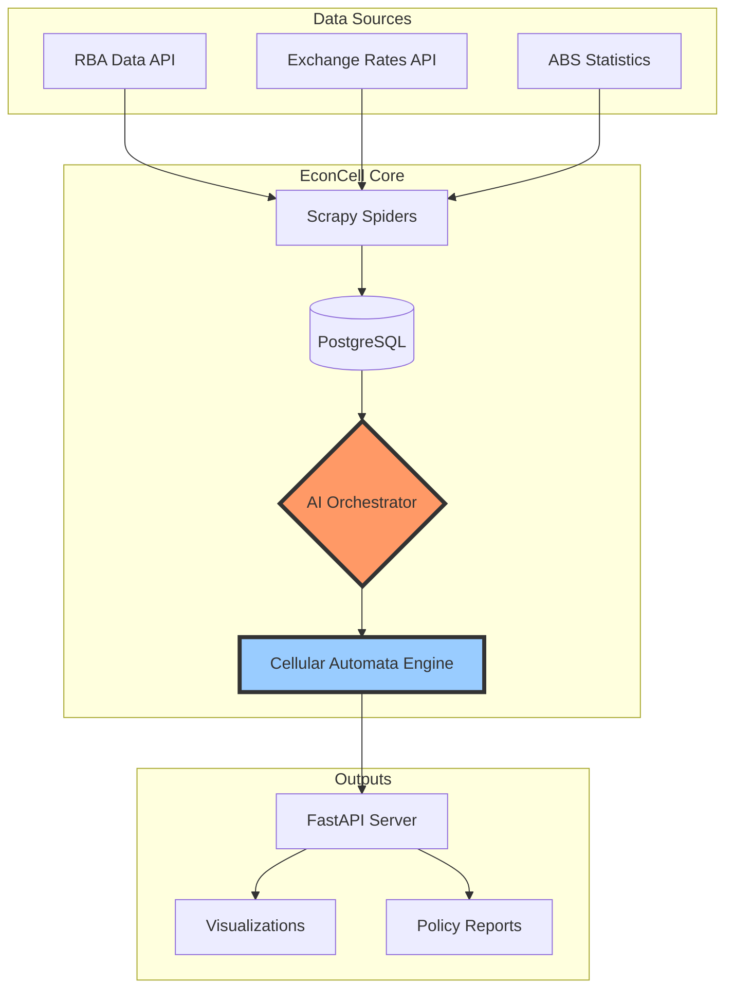

# 🌐 EconCell: Advanced Economic Modeling & Policy Analysis System

[](https://stand-with-ukraine.pp.ua)

<div align="center">


[](https://github.com/psf/black)

**Transform economic data into actionable insights using AI-powered cellular automata modeling**

[Features](#-features) •
[Architecture](#-architecture) •
[Quick Start](#-quick-start) •
[Documentation](#-documentation) •
[Contributing](#-contributing)

</div>

---

## 🎯 What is EconCell?

EconCell (Economic Cellular Simulation System) is a cutting-edge economic modeling platform that combines:

- 🤖 **Multiple AI Models** - Orchestrated LLMs including Qwen 32B and Llama 70B for economic analysis
- 📊 **Real-time Data Pipeline** - Automated collection from Reserve Bank of Australia (RBA) and global sources
- 🔄 **Circular Flow Modeling** - Implementation of RBA's economic framework using cellular automata
- ⚡ **GPU Acceleration** - High-performance simulations with intelligent resource management
- 🌍 **Multi-frequency Analysis** - Handle everything from daily FX rates to quarterly GDP data

### 🎬 See It In Action



## ✨ Features

### 🔮 AI-Powered Economic Intelligence
- **Multi-Model Consensus**: Critical analyses verified across multiple LLMs
- **Anomaly Detection**: ML-powered identification of unusual economic patterns
- **Natural Language Insights**: Complex economic relationships explained clearly
- **Predictive Modeling**: Forward-looking economic indicators and scenarios

### 📈 Comprehensive Data Integration
- **Automated Collection**: Scheduled spiders for RBA tables, exchange rates, and more
- **Data Quality Pipeline**: Validation, enrichment, and anomaly detection
- **Multi-frequency Alignment**: Intelligent resampling of mixed-frequency data
- **Historical Depth**: Access to decades of economic indicators

### 🏗️ Production-Ready Architecture
```python
# Example: Simple economic analysis
from econcell import AICoordinator, EconomicAnalyzer

async def analyze_inflation():
    coordinator = AICoordinator()
    analyzer = EconomicAnalyzer(coordinator)
    
    # AI-powered analysis with multi-model consensus
    result = await analyzer.analyze_inflation_drivers(
        components=['CPI', 'wage_growth', 'housing'],
        models=['qwen-32b', 'llama-70b'],
        consensus_required=True
    )
    
    return result.insights
```

### 🎨 Beautiful Visualizations
- Interactive circular flow diagrams
- Real-time currency exchange maps
- Economic indicator dashboards
- Policy impact simulations

## 🏛️ Architecture

### System Components

| Component | Purpose | Technology |
|-----------|---------|------------|
| **Data Ingestion** | Automated data collection | Scrapy, APScheduler |
| **Storage Layer** | Time-series optimized database | PostgreSQL with TimescaleDB |
| **AI System** | Economic analysis & insights | PyTorch, Transformers, Ollama |
| **API Layer** | RESTful data access | FastAPI, Pydantic |
| **Compute Engine** | Cellular automata simulations | NumPy, Numba, CUDA |

### Database Schema

The system uses a sophisticated star schema optimized for economic time-series:

```sql
-- Example: Circular flow components
CREATE TABLE rba_analytics.circular_flow (
    date DATE,
    frequency rba_dimensions.frequency_type,
    component VARCHAR(10), -- Y, C, I, G, X, M, S, T
    value NUMERIC,
    confidence_score FLOAT,
    ai_insights JSONB
);
```

## 🚀 Quick Start

### Prerequisites

- Python 3.12+
- PostgreSQL 15+
- CUDA-capable GPU (optional, for acceleration)
- 16GB+ RAM recommended

### Installation

```bash
# Clone the repository
git clone https://github.com/TheLustriVA/econcell.git
cd econcell

# Create virtual environment with uv (recommended)
uv venv
source .venv/bin/activate  # On Windows: .venv\Scripts\activate

# Install dependencies
uv pip install -e .

# Set up environment variables
cp .env.example .env
# Edit .env with your database credentials and API keys

# Initialize database
psql -U postgres -f debug/rba_circular_flow_postgresql_ddl.sql

# Run initial data collection
python src/scheduler/start_scheduler.py test-rba
```

### 🎮 Usage Examples

#### 1. Start the API Server
```bash
uvicorn frontend.api:app --reload --port 7001
```

#### 2. Query Economic Data
```python
import httpx

# Get latest GDP components
response = httpx.get("http://localhost:7001/api/v1/gdp/components")
gdp_data = response.json()

# Analyze inflation drivers
analysis = httpx.post(
    "http://localhost:7001/api/v1/analyze/inflation",
    json={"period": "2023-2024", "components": ["housing", "energy"]}
)
```

#### 3. Run Economic Simulations
```python
from econcell.simulation import CircularFlowSimulator

sim = CircularFlowSimulator()
results = sim.run_scenario({
    "interest_rate_change": 0.25,
    "government_spending_change": 1000000000,
    "export_shock": -0.05
})
```

## 📚 Documentation

### Core Concepts

- **[Circular Flow Model](docs/circular_flow.md)** - Understanding the RBA framework
- **[AI Architecture](docs/ai_system.md)** - Multi-model orchestration design
- **[Data Pipeline](docs/data_pipeline.md)** - From collection to insights
- **[API Reference](docs/api_reference.md)** - Complete endpoint documentation

### Tutorials

1. **[Building Your First Economic Model](docs/tutorials/first_model.md)**
2. **[Analyzing Policy Impacts](docs/tutorials/policy_analysis.md)**
3. **[Creating Custom Visualizations](docs/tutorials/visualizations.md)**
4. **[Extending the AI System](docs/tutorials/ai_extension.md)**

## 🤝 Contributing

We love contributions! EconCell is a community-driven project that welcomes developers, economists, and data scientists.

### How to Contribute

1. **Fork the repository**
2. **Create a feature branch** (`git checkout -b feature/amazing-feature`)
3. **Make your changes** and add tests
4. **Run quality checks**:
   ```bash
   pytest -v
   black --check src/
   mypy src/
   ```
5. **Commit** with a descriptive message
6. **Push** to your branch
7. **Open a Pull Request**

### Development Setup

```bash
# Install development dependencies
uv pip install -e ".[dev]"

# Run pre-commit hooks
pre-commit install

# Run tests with coverage
pytest --cov=econcell --cov-report=html
```

### Areas We Need Help

- 🌍 **Additional data sources** (ECB, Fed, BoE)
- 🎨 **Visualization improvements** (D3.js, Three.js)
- 🧮 **Economic model implementations**
- 📖 **Documentation and tutorials**
- 🌐 **Internationalization**

## 🔒 Security

- All credentials use environment variables
- API authentication via JWT tokens
- Database connections use SSL
- Regular dependency security audits

See [SECURITY.md](SECURITY.md) for reporting vulnerabilities.

## 📊 Performance

Benchmarks on typical hardware (RTX 3090, 64GB RAM):

| Operation | Time | Throughput |
|-----------|------|------------|
| RBA Data Ingestion | 45s | 10,000 rows/sec |
| AI Analysis (Qwen 32B) | 2.3s | 430 tokens/sec |
| Cellular Simulation (1M cells) | 0.8s | 1.25M cells/sec |
| API Response (cached) | 12ms | 83 req/sec |

## 🚧 Roadmap

### Phase 1: Foundation ✅
- [x] RBA data pipeline
- [x] Multi-frequency architecture
- [x] Basic AI integration
- [x] SystemD service management

### Phase 2: Intelligence (Current)
- [ ] Advanced ML models for prediction
- [ ] Natural language query interface
- [ ] Real-time anomaly detection
- [ ] Policy recommendation engine

### Phase 3: Scale
- [ ] Distributed computing support
- [ ] International data sources
- [ ] Multi-language support
- [ ] Cloud deployment templates

### Phase 4: Innovation
- [ ] Quantum economic modeling
- [ ] Blockchain integration
- [ ] AR/VR visualizations
- [ ] Academic collaboration portal

## 📄 License

This project is licensed under the MIT License - see the [LICENSE](LICENSE) file for details.

## 🙏 Acknowledgments

- **Reserve Bank of Australia** for open data access
- **Australian Bureau of Statistics** for comprehensive datasets
- **Open source community** for amazing tools and libraries
- **Contributors** who make this project better every day

## 📮 Contact

- **Project Lead**: Kieran [@TheLustriVA](https://github.com/TheLustriVA)
- **Email**: econcell@proton.me
- **Discord**: [Join our community](https://discord.gg/econcell)
- **Twitter**: [@EconCell](https://twitter.com/econcell)

---

<div align="center">

**Built with ❤️ by economists and engineers who believe in open source**

*"The best way to predict the future is to model it"*

[⬆ Back to top](#-econcell-advanced-economic-modeling--policy-analysis-system)

</div>