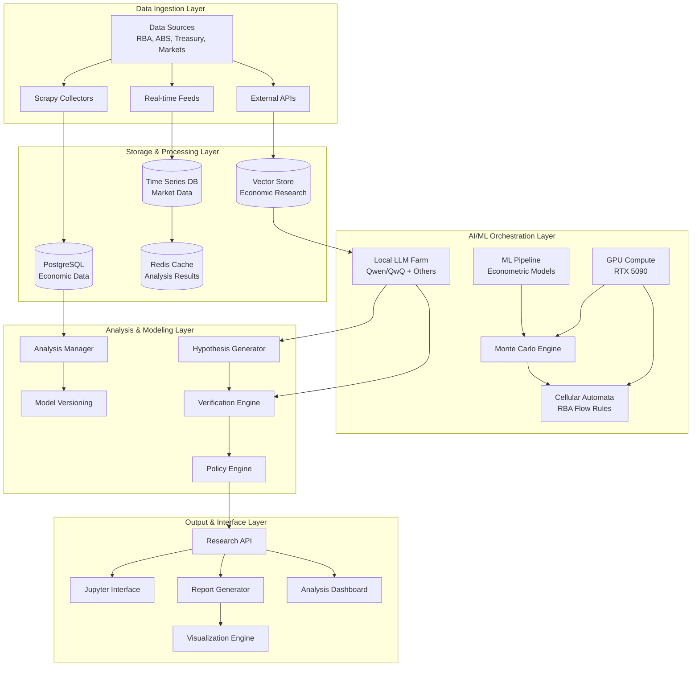
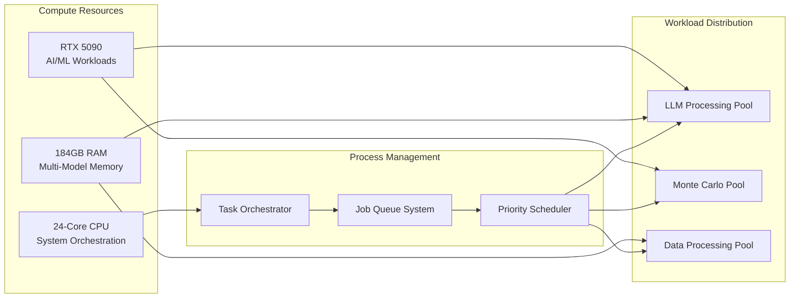
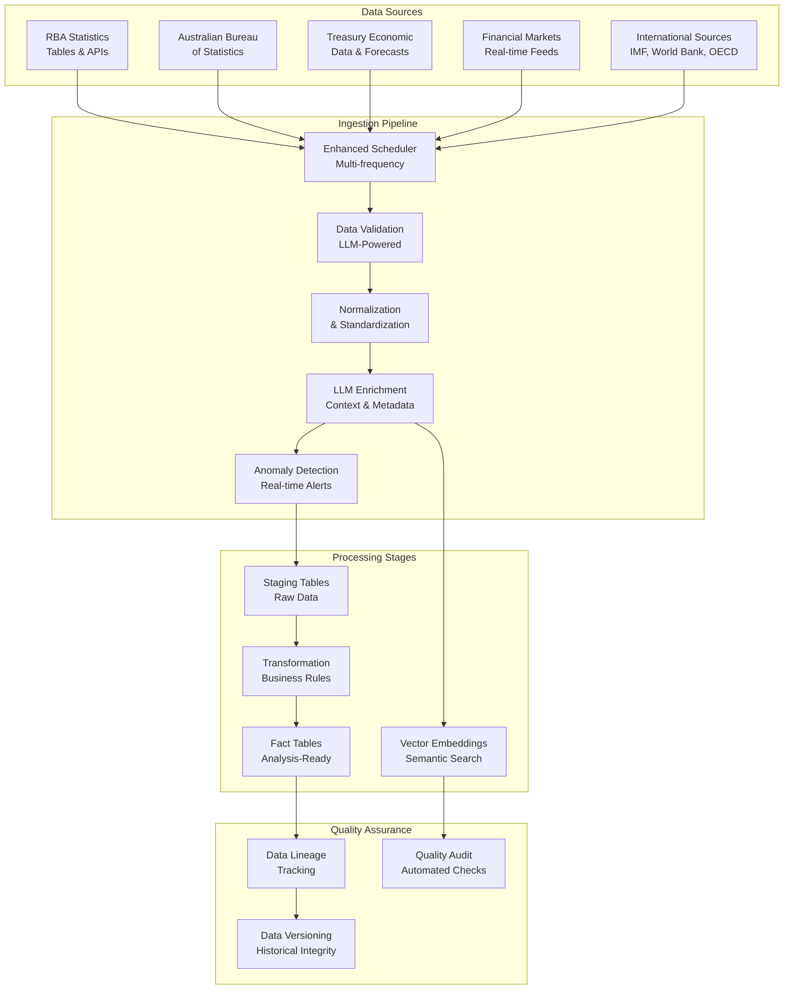
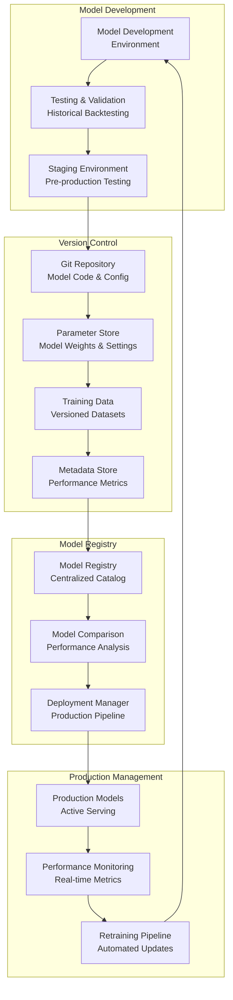
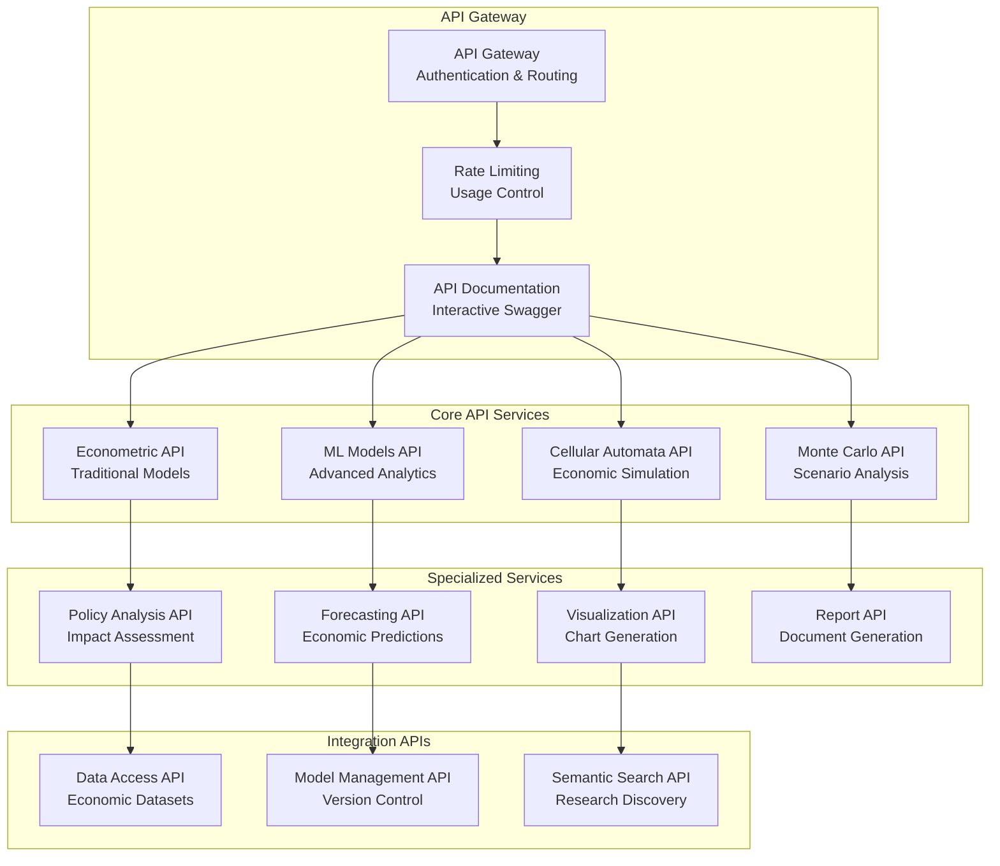
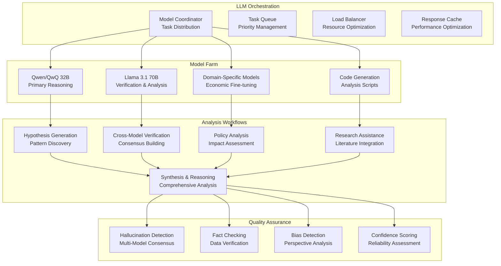
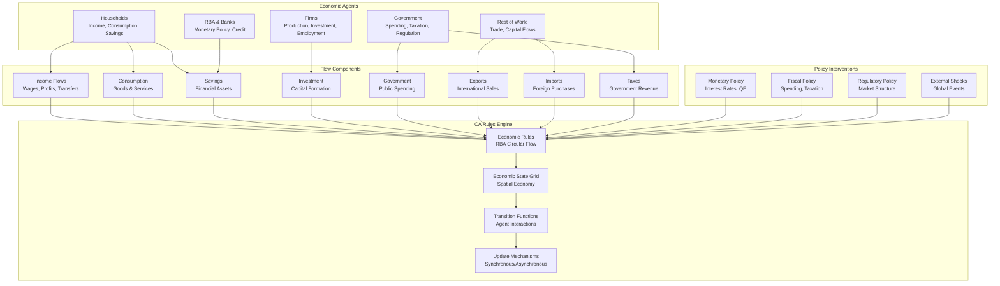

# EconCell Advanced Economic Modeling Platform - Technical Architecture

## Executive Summary

EconCell is an advanced economic modeling platform that transforms traditional economic analysis through the integration of locally-hosted large language models, GPU-accelerated Monte Carlo simulations, and innovative cellular automata modeling based on the Reserve Bank of Australia's (RBA) circular flow framework. The platform is designed for single-user research and analysis, optimized for high-end hardware specifications to support sophisticated economic modeling and policy analysis.

### Platform Vision
Combine traditional econometric approaches with AI-driven pattern recognition to continuously analyze economic datasets, generate novel explanatory models, and provide cutting-edge economic policy analysis focused on Australian economic conditions.

### Key Objectives
- **Research Excellence**: Enable production of high-quality economic analysis for academic publication and policy consultation
- **Media Expertise**: Support expert commentary and analysis for media engagement
- **Policy Analysis**: Generate sophisticated policy impact assessments and recommendations
- **Innovation**: Pioneer the use of cellular automata modeling in macroeconomic analysis

## System Architecture Overview

## Hardware Specifications & Utilization

### Target Hardware Configuration
- **CPU**: AMD Ryzen 9 9900X3D (24 cores) @ 5.58 GHz
- **GPU**: NVIDIA GeForce RTX 5090 (24GB VRAM)
- **RAM**: 184GB DDR5
- **Storage**: NVMe SSD (high-speed data access)
- **OS**: Ubuntu 25.04 x86_64

### Resource Allocation Strategy
- **GPU Utilization**:
  - 60% for LLM inference (multiple model instances)
  - 30% for Monte Carlo simulations
  - 10% for econometric model training
- **RAM Distribution**:
  - 64GB for LLM model instances and inference
  - 32GB for economic data caching and processing
  - 64GB for Monte Carlo scenario generation
  - 24GB for system operations and application services

## 1. Distributed Computing Infrastructure

### Single-Node Optimization Architecture

### Key Features
- **Asynchronous Processing**: Concurrent execution of LLM inference, Monte Carlo simulations, and data processing
- **Smart Memory Management**: Dynamic allocation between different workload types
- **GPU Compute Optimization**: CUDA/OpenCL integration for maximum throughput
- **Process Isolation**: Containerized services with resource limits

### Scalability Considerations
- **Local LLM Hosting**: Support for multiple simultaneous model instances
- **Computational Throughput**: Optimized for complex economic simulations
- **Memory Efficiency**: Advanced caching strategies for large datasets
- **Load Balancing**: Intelligent task distribution across available resources

## 2. Data Pipeline Design

### Enhanced Data Ingestion Architecture

### Real-time and Batch Processing
- **Real-time Processing**: Market data, policy announcements, breaking economic news
- **Batch Processing**: Historical data updates, comprehensive dataset refreshes
- **Hybrid Processing**: Combine real-time alerts with batch validation

### Data Validation & Cleaning Framework
- **LLM-Powered Validation**: Intelligent detection of data inconsistencies and errors
- **Automated Quality Checks**: Statistical outlier detection and pattern validation
- **Contextual Understanding**: Economic domain knowledge applied to data validation
- **Error Correction**: Automated fixes for common data quality issues

### Integration with Existing Sources
- **RBA Integration**: Enhanced scraping of statistics tables, policy documents, and speeches
- **ABS Data Pipeline**: Automated ingestion of national accounts, labor statistics, and demographic data
- **Treasury Integration**: Budget papers, economic forecasts, and policy documents
- **Financial Markets**: Real-time exchange rates, commodity prices, and market indicators

### Data Versioning & Lineage Tracking
- **Comprehensive Lineage**: Track data from source to final analysis
- **Version Control**: Git-like versioning for economic datasets
- **Impact Analysis**: Understand how data changes affect model outputs
- **Audit Trail**: Complete record of data transformations and decisions

## 3. Model Versioning & Management Systems

### Comprehensive Model Lifecycle Management

### Framework for Managing Multiple Economic Modeling Approaches
- **Traditional Econometrics**: ARIMA, VAR, VECM, and cointegration models
- **Machine Learning Models**: Neural networks, ensemble methods, deep learning approaches
- **Agent-Based Models**: Individual and institutional economic behavior simulation
- **Cellular Automata**: RBA circular flow-based economic system modeling
- **Hybrid Models**: Combinations of traditional and modern approaches

### Version Control System
- **Model Code Versioning**: Git-based tracking of model implementations
- **Parameter Versioning**: Systematic tracking of model hyperparameters and weights
- **Training Data Versioning**: Immutable datasets with clear provenance
- **Performance Versioning**: Historical tracking of model accuracy and performance metrics

### A/B Testing Infrastructure
- **Parallel Model Execution**: Run multiple model versions simultaneously
- **Performance Comparison**: Statistical significance testing of model improvements
- **Economic Scenario Testing**: Evaluate models across different economic conditions
- **Gradual Rollout**: Staged deployment of improved model versions

### Automated Model Retraining & Deployment
- **Trigger-Based Retraining**: Automatic model updates based on performance degradation
- **Data-Driven Updates**: Retrain models when new significant economic data becomes available
- **Policy Change Adaptation**: Model updates in response to economic policy changes
- **Continuous Integration**: Automated testing and deployment pipeline

## 4. API Framework Architecture

### RESTful API Design for Economic Analysis

### Support for Multiple Economic Modeling Approaches
- **Classical Econometrics**: Time series analysis, regression models, causality testing
- **Agent-Based Simulations**: Individual and institutional behavior modeling
- **Behavioral Economics**: Sentiment analysis, behavioral pattern recognition
- **Policy Impact Assessment**: Scenario modeling and policy effectiveness analysis

### Real-time Prediction APIs
- **Economic Indicators**: Real-time forecasting of key economic metrics
- **Market Predictions**: Financial market and commodity price forecasting
- **Policy Impact**: Real-time assessment of policy announcement effects
- **Risk Assessment**: Economic risk and uncertainty quantification

### Batch Analysis Endpoints
- **Historical Analysis**: Comprehensive analysis of historical economic patterns
- **Comparative Studies**: Cross-country and cross-period economic comparisons
- **Structural Analysis**: Deep dive into economic relationships and dependencies
- **Research Support**: Bulk analysis capabilities for academic research

### Authentication, Rate Limiting & Usage Tracking
- **JWT Authentication**: Secure API access with token-based authentication
- **Role-Based Access**: Different access levels for different analysis capabilities
- **Usage Monitoring**: Comprehensive tracking of API usage and performance
- **Resource Management**: Intelligent queuing and priority management for analysis requests

## 5. AI Integration Architecture

### Multi-Model LLM System

### Local LLM Integration Strategy
- **Primary Model**: Qwen/QwQ 32B for core economic reasoning and analysis
- **Verification Model**: Llama 3.1 70B for cross-checking and validation
- **Specialized Models**: Fine-tuned models for specific economic domains
- **Code Generation**: Specialized models for generating analysis scripts and visualizations

### Continuous Economic Dataset Interrogation
- **Automated Pattern Detection**: LLMs continuously analyze incoming economic data for patterns
- **Anomaly Identification**: Real-time detection of unusual economic indicators or relationships
- **Hypothesis Generation**: Automatic formulation of economic hypotheses based on data patterns
- **Relationship Discovery**: Identification of novel economic relationships and dependencies

### Novel Relationship Discovery & Policy Impact Scenarios
- **Economic Relationship Mining**: Discovery of new economic relationships through data analysis
- **Policy Scenario Generation**: Creation of comprehensive policy impact scenarios
- **Counterfactual Analysis**: "What-if" analysis for economic policy decisions
- **Interdisciplinary Insights**: Integration of economic analysis with other domains

### Natural Language Interface for Economic Queries
- **Conversational Analysis**: Natural language interface for complex economic queries
- **Research Assistant**: AI-powered research support for economic analysis
- **Report Generation**: Automated generation of economic reports and policy briefs
- **Data Exploration**: Natural language queries for economic data exploration

### Hallucination Prevention & Multi-Model Verification
- **Consensus Mechanisms**: Multiple models must agree on key economic conclusions
- **Fact Verification**: Automatic fact-checking against trusted economic data sources
- **Confidence Scoring**: Reliability assessment for all AI-generated insights
- **Human-in-the-Loop**: Strategic checkpoints for human validation of critical insights

## 6. Cellular Automata Economic Modeling

### RBA Circular Flow Cellular Automata Engine

### Economic Agent Modeling
- **Households**: Income distribution, consumption patterns, savings behavior, labor supply
- **Firms**: Production decisions, investment strategies, employment policies, pricing behavior
- **Government**: Fiscal policy implementation, public service provision, regulatory enforcement
- **RBA & Financial Sector**: Monetary policy transmission, credit creation, financial stability
- **Rest of World**: Trade relationships, capital flows, external economic influences

### RBA Circular Flow Rule Implementation
- **Income-Expenditure Identity**: Y = C + I + G + (X - M)
- **Financial Flow Constraints**: Savings must equal investment in equilibrium
- **Sectoral Balance Relationships**: Government, private, and foreign sector balances
- **Money Flow Dynamics**: Monetary circulation and velocity considerations

### Spatial Economic Modeling
- **Geographic Distribution**: Economic activity distributed across spatial grid
- **Regional Interactions**: Inter-regional trade and economic relationships
- **Urban-Rural Dynamics**: Different economic behaviors in urban vs. rural areas
- **Infrastructure Effects**: Impact of infrastructure on economic flows

### Policy Simulation Capabilities
- **Monetary Policy**: Interest rate changes, quantitative easing, macroprudential measures
- **Fiscal Policy**: Government spending changes, tax policy modifications, transfer programs
- **Structural Reform**: Labor market reforms, regulatory changes, trade policy
- **External Shocks**: Commodity price changes, global economic crises, trade disruptions

## 7. Implementation Phases & Technical Milestones

### Phase 1: Foundation Enhancement (Weeks 1-4)

#### Week 1-2: LLM Integration Framework
- **Multi-Model Serving Setup**: Implement Ollama/vLLM for concurrent model serving
- **Model Orchestration**: Build task queue and load balancing system
- **Memory Management**: Implement smart memory allocation for multiple LLM instances
- **Performance Optimization**: GPU utilization optimization for concurrent inference

**Technical Deliverables:**
- Multi-model LLM serving infrastructure
- Task orchestration and queuing system
- Performance monitoring and optimization tools
- Initial economic context injection framework

#### Week 3-4: Enhanced Data Pipeline
- **Data Source Expansion**: Integrate ABS, Treasury, and additional market data sources
- **LLM-Powered Enrichment**: Implement intelligent data categorization and validation
- **Real-time Processing**: Add streaming data processing capabilities
- **Quality Assurance**: Automated data quality checks and anomaly detection

**Technical Deliverables:**
- Expanded data ingestion pipeline
- LLM-powered data enrichment system
- Real-time data processing capabilities
- Automated quality assurance framework

### Phase 2: Core AI Analytics (Weeks 5-8)

#### Week 5-6: Hypothesis Generation System
- **Pattern Detection Engine**: LLM-based pattern recognition in economic data
- **Research Question Formulation**: Automated generation of economic research questions
- **Multi-Model Verification**: Cross-model consensus and validation workflows
- **Confidence Scoring**: Reliability assessment for AI-generated insights

**Technical Deliverables:**
- Hypothesis generation and validation system
- Multi-model consensus mechanisms
- Confidence scoring and reliability assessment
- Research question formulation tools

#### Week 7-8: Advanced Modeling Framework
- **Monte Carlo Implementation**: GPU-accelerated Monte Carlo simulation engine
- **Traditional Model Integration**: Seamless integration of econometric models
- **Model Comparison System**: Automated performance comparison and validation
- **Hybrid Model Support**: Framework for combining different modeling approaches

**Technical Deliverables:**
- Monte Carlo simulation engine
- Integrated econometric modeling framework
- Model comparison and validation system
- Hybrid modeling capabilities

### Phase 3: Cellular Automata Engine (Weeks 9-12)

#### Week 9-10: CA Framework Development
- **RBA Rule Implementation**: Encode circular flow relationships as CA rules
- **Agent Behavior Modeling**: Implement economic agent decision-making logic
- **Spatial Grid System**: Create spatial representation of economic activity
- **Interaction Mechanisms**: Define agent-to-agent interaction protocols

**Technical Deliverables:**
- Cellular automata framework
- RBA circular flow rule engine
- Economic agent behavior models
- Spatial economic grid system

#### Week 11-12: Australian Economic Specialization
- **RBA Policy Integration**: Model specific RBA monetary policy tools and effects
- **Commodity Price Modeling**: Integration of Australian commodity dependencies
- **Trade Relationship Analysis**: Model Australia's key trading relationships
- **Sector-Specific Modeling**: Detailed modeling of key Australian economic sectors

**Technical Deliverables:**
- Australian-specific economic models
- RBA policy simulation capabilities
- Commodity price integration
- Trade relationship modeling

### Phase 4: Research Interface & Output Systems (Weeks 13-16)

#### Week 13-14: Analysis Interface Development
- **Jupyter Integration**: Seamless notebook interface for economic analysis
- **Interactive Dashboard**: Web-based dashboard for economic monitoring and analysis
- **Visualization Framework**: Advanced charting and visualization capabilities
- **Natural Language Interface**: Conversational interface for economic queries

**Technical Deliverables:**
- Jupyter notebook integration
- Interactive analysis dashboard
- Advanced visualization system
- Natural language query interface

#### Week 15-16: Output Generation Systems
- **Report Automation**: Automated generation of economic reports and policy briefs
- **Academic Paper Support**: Tools for generating academic paper drafts
- **Media Content Creation**: Rapid generation of media-ready economic analysis
- **Policy Brief Generation**: Automated policy analysis and recommendation system

**Technical Deliverables:**
- Automated report generation system
- Academic paper drafting tools
- Media content creation capabilities
- Policy brief automation

## 8. Technology Stack Recommendations

### Core Infrastructure
- **Containerization**: Docker with Docker Compose for service orchestration
- **Message Queue**: Redis for task coordination and result caching
- **Process Management**: Supervisor for service monitoring and restart
- **Monitoring**: Prometheus + Grafana for comprehensive system monitoring
- **Logging**: ELK Stack (Elasticsearch, Logstash, Kibana) for centralized logging

### Database Systems
- **Primary Database**: PostgreSQL 16+ with advanced analytical extensions
- **Time Series Database**: InfluxDB for high-frequency economic data
- **Vector Database**: Chroma for economic research embeddings and semantic search
- **Cache Layer**: Redis for high-performance data caching
- **Search Engine**: Elasticsearch for full-text search of economic documents

### AI/ML Framework
- **LLM Serving**: Ollama + vLLM for efficient model serving and inference
- **ML Framework**: PyTorch 2.0+ for econometric model development
- **GPU Computing**: CuPy and CuML for CUDA-accelerated computations
- **Statistical Computing**: R integration via rpy2 for specialized econometric analysis
- **Distributed Computing**: Ray for distributed processing when needed

### Econometric & Analysis Tools
- **Core Econometrics**: statsmodels, arch, linearmodels, pyeconometrics
- **Time Series Analysis**: prophet, sktime, tslearn, pmdarima
- **Cellular Automata**: Mesa framework with custom GPU extensions
- **Monte Carlo**: Custom CUDA implementations with Numba acceleration
- **Optimization**: SciPy, CVXPY, Pyomo for economic optimization problems

### Web Framework & APIs
- **API Framework**: FastAPI with automatic OpenAPI documentation
- **Authentication**: JWT-based authentication with role-based access control
- **Rate Limiting**: slowapi for API rate limiting and throttling
- **API Documentation**: Swagger UI with custom economic domain documentation
- **Web Frontend**: React.js with TypeScript for dashboard interfaces

### Visualization & Reporting
- **Interactive Visualizations**: Plotly, Altair, Bokeh for dynamic charts
- **Static Visualizations**: Matplotlib, Seaborn for publication-quality figures
- **Dashboard Framework**: Streamlit for rapid prototype dashboards
- **Report Generation**: Jupyter notebooks with nbconvert for automated reporting
- **Document Generation**: LaTeX integration for academic paper formatting

### Development & Deployment Tools
- **Version Control**: Git with GitLab or GitHub for code management
- **IDE Integration**: VS Code with Python and R extensions
- **Testing Framework**: pytest for comprehensive testing
- **Code Quality**: Black, isort, flake8 for code formatting and linting
- **Documentation**: Sphinx for technical documentation generation

## 9. Resource Requirements & Hardware Utilization

### Computational Resources
- **CPU Utilization**:
  - 8 cores for system operations and web services
  - 8 cores for data processing and ETL operations
  - 8 cores for traditional econometric computations
- **GPU Utilization**:
  - 60% allocation for LLM inference (multiple concurrent models)
  - 30% allocation for Monte Carlo simulations and cellular automata
  - 10% reserved for ad-hoc GPU computations

### Memory Management Strategy
- **LLM Memory Allocation**:
  - 32GB for primary Qwen/QwQ 32B model instance
  - 24GB for secondary Llama 3.1 70B model instance
  - 8GB for specialized domain models
- **Data Processing Memory**:
  - 32GB for economic dataset caching
  - 16GB for intermediate processing results
  - 8GB for vector embeddings and search indices
- **Monte Carlo Simulation Memory**:
  - 64GB for scenario generation and parallel processing

### Storage Requirements
- **Primary Storage**: 2TB NVMe SSD for system, applications, and active datasets
- **Model Storage**: 500GB for LLM models and weights
- **Data Archive**: 1TB for historical economic data and research archives
- **Backup Storage**: Network-attached storage for system and data backups

### Network & Connectivity
- **Internet Bandwidth**: High-speed connection for real-time data feeds
- **API Rate Limits**: Manage external API usage to stay within service limits
- **Data Transfer**: Efficient protocols for large dataset synchronization

## 10. Security & Compliance Requirements

### Data Security
- **Encryption**: End-to-end encryption for sensitive economic data
- **Access Control**: Role-based access with multi-factor authentication
- **Data Isolation**: Secure separation of different data classification levels
- **Audit Logging**: Comprehensive logging of all data access and modifications

### Government Data Handling
- **Compliance Standards**: Adherence to Australian Government data handling requirements
- **Data Classification**: Proper classification and handling of official economic data
- **Retention Policies**: Appropriate data retention and disposal procedures
- **Privacy Protection**: Ensure privacy compliance for any personal economic data

### System Security
- **Container Security**: Secure container configurations and regular updates
- **Network Security**: Firewall configurations and network segmentation
- **Vulnerability Management**: Regular security updates and vulnerability assessments
- **Backup Security**: Encrypted backups with secure key management

## 11. Performance Optimization & Monitoring

### Performance Metrics
- **System Performance**:
  - GPU utilization and memory efficiency
  - CPU usage patterns and load balancing
  - Memory allocation and garbage collection metrics
  - Disk I/O performance and storage utilization
- **AI/ML Performance**:
  - Model inference latency and throughput
  - LLM response quality and consistency
  - Monte Carlo simulation convergence rates
  - Econometric model accuracy and validation metrics

### Monitoring & Alerting
- **Infrastructure Monitoring**: Comprehensive monitoring of all system components
- **Application Performance**: Detailed performance metrics for each service
- **Model Performance**: Continuous monitoring of model accuracy and drift
- **Business Metrics**: Economic analysis quality and output metrics

### Optimization Strategies
- **GPU Optimization**: Batch processing and memory management for maximum GPU utilization
- **Memory Optimization**: Intelligent caching and memory pool management
- **Database Optimization**: Query optimization and index management
- **Network Optimization**: Efficient data transfer and API response optimization

## 12. Backup, Disaster Recovery & Data Retention

### Backup Strategy
- **System Backups**: Regular full system backups with incremental updates
- **Data Backups**: Automated backup of all economic datasets and research outputs
- **Model Backups**: Version-controlled storage of all trained models and parameters
- **Configuration Backups**: Backup of system configurations and deployment scripts

### Disaster Recovery Plan
- **Recovery Point Objective (RPO)**: Maximum 4 hours of data loss acceptable
- **Recovery Time Objective (RTO)**: System restoration within 24 hours
- **Backup Testing**: Regular testing of backup and recovery procedures
- **Documentation**: Complete disaster recovery documentation and procedures

### Data Retention Policies
- **Economic Data**: Long-term retention of historical economic datasets
- **Analysis Results**: Archive completed analysis with full provenance
- **Model Versions**: Retain model versions with performance history
- **System Logs**: Structured log retention for debugging and audit purposes

## 13. Integration Points & External Systems

### Economic Data Sources
- **RBA Integration**: Enhanced integration with RBA statistical systems and publications
- **ABS Integration**: Automated access to Australian Bureau of Statistics datasets
- **Treasury Integration**: Connection to Treasury economic forecasts and policy documents
- **International Sources**: Integration with IMF, World Bank, OECD datasets

### Financial Market Integration
- **Real-time Market Data**: Integration with financial market data providers
- **Commodity Prices**: Australian commodity price feeds and forecasting
- **Exchange Rates**: Real-time currency exchange rate monitoring
- **Market Sentiment**: Integration of market sentiment and news analytics

### Research & Academic Integration
- **Literature Databases**: Integration with economic research databases
- **Citation Management**: Automated citation and reference management
- **Collaboration Tools**: Integration with academic collaboration platforms
- **Publication Workflows**: Streamlined workflows for academic publication

## 14. Risk Assessment & Mitigation Strategies

### Technical Risks
- **Model Hallucination Risk**:
  - *Mitigation*: Multi-model verification and consensus mechanisms
  - *Monitoring*: Continuous hallucination detection and quality scoring
  - *Response*: Automated flagging and human verification workflows
- **Resource Exhaustion Risk**:
  - *Mitigation*: Smart resource management and allocation policies
  - *Monitoring*: Real-time resource utilization monitoring
  - *Response*: Automatic scaling and priority-based task management
- **Data Quality Risk**:
  - *Mitigation*: Automated data validation and quality assessment
  - *Monitoring*: Continuous data quality monitoring and alerting
  - *Response*: Data quality incident response and correction procedures

### Research & Analysis Risks
- **Model Overfitting Risk**:
  - *Mitigation*: Robust cross-validation and out-of-sample testing
  - *Monitoring*: Continuous model performance monitoring
  - *Response*: Automated model retraining and validation procedures
- **Bias Introduction Risk**:
  - *Mitigation*: Diverse model ensemble and bias detection algorithms
  - *Monitoring*: Regular bias assessment and fairness metrics
  - *Response*: Bias correction procedures and model adjustment protocols
- **Analytical Error Risk**:
  - *Mitigation*: Multiple verification layers and human oversight
  - *Monitoring*: Error detection and consistency checking
  - *Response*: Error correction workflows and quality assurance procedures

### Operational Risks
- **System Failure Risk**:
  - *Mitigation*: Redundant systems and comprehensive backup procedures
  - *Monitoring*: Proactive system health monitoring and alerting
  - *Response*: Rapid recovery procedures and disaster recovery protocols
- **Data Loss Risk**:
  - *Mitigation*: Multiple backup layers and data replication
  - *Monitoring*: Backup integrity monitoring and validation
  - *Response*: Data recovery procedures and business continuity planning

## 15. Success Metrics & Key Performance Indicators

### Analytical Performance Metrics
- **Economic Forecast Accuracy**: Measure prediction accuracy against actual economic outcomes
- **Research Productivity**: Track number and quality of economic analyses produced
- **Model Convergence Rates**: Monitor consensus rates across multi-model verification
- **Hypothesis Validation Success**: Track success rate of AI-generated economic hypotheses

### System Performance Metrics
- **Processing Speed**: Time from data ingestion to analysis completion
- **Resource Utilization Efficiency**: GPU, CPU, and memory utilization optimization
- **Model Quality Scores**: Hallucination detection rates and accuracy assessments
- **System Reliability**: Uptime, error rates, and service availability metrics

### Research Impact Metrics
- **Publication Success**: Academic papers, policy briefs, and media contributions
- **Policy Influence**: Track adoption of economic analysis in policy discussions
- **Innovation Metrics**: Novel economic relationships discovered and validated
- **User Satisfaction**: Quality and usefulness of generated economic insights

### Business Value Metrics
- **Analysis Cost Efficiency**: Cost per economic analysis compared to traditional methods
- **Time to Insight**: Speed of generating actionable economic insights
- **Decision Support Quality**: Effectiveness of analysis in supporting economic decisions
- **Competitive Advantage**: Unique insights and analytical capabilities developed

## Conclusion

This comprehensive technical architecture provides a solid foundation for developing EconCell into a world-class economic modeling and analysis platform. The architecture leverages cutting-edge AI technology, advanced econometric methods, and innovative cellular automata modeling to create a unique and powerful tool for economic research and policy analysis.

The platform is specifically designed to support high-quality economic research, policy analysis, and media engagement while maintaining the flexibility to evolve with advancing AI technology and changing economic analysis needs. The focus on Australian economic conditions, combined with the innovative use of RBA circular flow modeling and cellular automata, positions this platform to generate novel insights and contribute significantly to economic understanding and policy development.

The implementation plan provides a structured approach to building this sophisticated system while maintaining focus on practical research applications and high-quality analytical outputs. The emphasis on multi-model verification, quality assurance, and comprehensive monitoring ensures that the platform will produce reliable, trustworthy economic analysis suitable for academic publication, policy consultation, and media engagement.