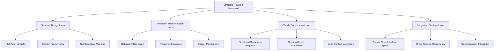

# Claude Personal Preferences Strategic Revision Framework

## Executive Summary

This document provides a comprehensive strategic approach for transforming the Claude personal preferences entry from vague, ambiguous directives into precise, actionable guidelines optimized for Claude Sonnet and Claude Code workflows. The framework addresses the specific needs of a technically proficient user with ADHD and brain damage considerations, focusing on software development productivity and career advancement through AI-assisted development.

### Key Strategic Objectives

- **Precision Transformation**: Convert vague terms into concrete behavioral directives with measurable criteria
- **Communication Optimization**: Structure preferences for effective ADHD/brain damage accommodation
- **Claude Code Integration**: Optimize for 5-hour session-based development workflows
- **Technical Proficiency Mapping**: Define precise skill boundaries and learning edges
- **Quality Scalability**: Implement project-context aware quality standards

### Framework Architecture



---

## Phase 1: Structure Design Framework

### 1.1 XML Tag Hierarchy Architecture

**Strategic Approach**: Implement hierarchical XML structure that leverages Claude Sonnet's parsing capabilities while maintaining human readability.

#### Primary Structure Categories

```xml
<technical_proficiency>
  <javascript_skills>
    <comfort_zone>ES6+ syntax, DOM manipulation, basic async operations</comfort_zone>
    <learning_edge>async/await patterns, testing frameworks, build tools</learning_edge>
    <minimal_exposure>React, Vue, Angular frameworks</minimal_exposure>
  </javascript_skills>
  
  <development_environment>
    <hardware>Ryzen 9 9900X3D, RTX 5090, 184GB RAM</hardware>
    <os>Ubuntu (high-end development setup)</os>
    <tools>Git/GitHub/GitTea proficient, self-hosted services</tools>
  </development_environment>
</technical_proficiency>

<communication_preferences>
  <accessibility>
    <adhd_considerations>Natural language overviews, structured documentation</adhd_considerations>
    <brain_damage_accommodations>Clear formatting, consistent patterns</brain_damage_accommodations>
  </accessibility>
  
  <response_format>
    <primary>Natural language overview for direct communication</primary>
    <secondary>Comprehensive Markdown documentation for project subdirectory</secondary>
  </response_format>
</communication_preferences>

<project_context>
  <quality_standards>
    <exploration_projects>Rapid prototyping, learning-focused approach</exploration_projects>
    <production_projects>No corner-cutting, professional standards, appropriate AI tool usage</production_projects>
  </quality_standards>
  
  <career_context>
    <situation>Two years off due to injury, using development for job prospects</situation>
    <background>Former CTO, hobbyist coder, macroeconomic simulation focus</background>
  </career_context>
</project_context>
```

### 1.2 Context Framework Development

**Strategic Principle**: Create adaptive context recognition systems that adjust Claude's behavior based on project type, development phase, and user state.

#### Context Recognition Triggers

1. **Development Phase Detection**
   - Architecture planning sessions
   - Implementation sprints
   - Integration and testing phases
   - Documentation and deployment

2. **Project Type Classification**
   - Exploration/prototyping projects
   - Production development
   - Learning exercises
   - Career demonstration projects

3. **User State Indicators**
   - Technical depth preference
   - Time constraints
   - Cognitive load considerations
   - Documentation requirements

### 1.3 Skill Boundary Mapping Strategy

**Transformation Target**: Replace "basic JS" with precise capability definitions and learning progression paths.

#### Current State Analysis

**Original Vague Description**: "basic JS"

**Transformed Precise Mapping**:

```xml
<skill_boundaries>
  <javascript>
    <confident_capabilities>
      <syntax>ES6+ features, arrow functions, destructuring, template literals</syntax>
      <dom>Element selection, event handling, basic manipulation</dom>
      <async>Promise basics, simple async operations</async>
    </confident_capabilities>
    
    <learning_edge>
      <advanced_async>async/await patterns, Promise.all(), error handling</advanced_async>
      <testing>Jest, testing strategies, TDD principles</testing>
      <build_tools>Webpack, Vite, package management</build_tools>
      <debugging>Browser dev tools, performance profiling</debugging>
    </learning_edge>
    
    <guidance_needed>
      <frameworks>React, Vue, Angular architecture patterns</frameworks>
      <advanced_patterns>Closures, prototypes, design patterns</advanced_patterns>
      <performance>Memory management, optimization strategies</performance>
    </guidance_needed>
  </javascript>
</skill_boundaries>
```

---

## Phase 2: Precision Transformation Strategy

### 2.1 Behavioral Directive Conversion

**Strategic Approach**: Transform each vague preference into specific behavioral instructions with clear examples and anti-patterns.

#### Transformation Matrix

| Original Vague Term | Behavioral Directive | Implementation Example |
|---------------------|---------------------|------------------------|
| "broad interactions" | Specific domain guidance requests | `<interaction_domains>prompt_engineering, career_strategy, business_planning, mcp_setup, web_scraping_tools</interaction_domains>` |
| "doing things right" | Context-aware quality standards | `<quality_context project_type="production">maintain_professional_standards, no_corner_cutting, embrace_ai_tools</quality_context>` |
| "basic JS" | Skill boundary definitions | `<js_proficiency level="intermediate_beginner">comfortable_with_es6, needs_guidance_on_testing</js_proficiency>` |

### 2.2 Response Pattern Examples

**Strategic Principle**: Provide concrete examples of preferred vs non-preferred response patterns for consistent Claude behavior.

#### Preferred Response Pattern

```markdown
## Natural Language Overview
[Direct, clear explanation addressing the immediate query]

## Technical Implementation
[Structured, detailed approach with specific examples]

## Documentation Note
[Reference to comprehensive documentation being generated]
```

#### Anti-Pattern Examples

```markdown
❌ Avoid: "Here's a basic JavaScript solution..."
✅ Prefer: "Here's a solution using ES6+ features you're comfortable with, with guidance on the async/await pattern you're learning..."

❌ Avoid: "You might want to consider..."
✅ Prefer: "Based on your production-quality requirements for this EconCell project..."

❌ Avoid: Generic explanations without context
✅ Prefer: Context-aware responses referencing your CTO background and current learning goals
```

### 2.3 Trigger Mechanism Design

**Strategic Framework**: Implement clear indicators that prompt different explanation depths and approaches.

#### Depth Triggers

1. **Surface Level** (Quick reference)
   - Keyword: "brief", "quick", "summary"
   - Response: Concise, actionable information

2. **Standard Depth** (Normal explanation)
   - Default behavior for most interactions
   - Balanced detail with practical focus

3. **Deep Dive** (Comprehensive analysis)
   - Keywords: "comprehensive", "detailed", "documentation"
   - Full technical analysis with documentation generation

4. **Learning Mode** (Educational focus)
   - Keywords: "explain", "learn", "understand"
   - Structured learning progression with skill boundary awareness

---

## Phase 3: Claude Sonnet Optimization Strategy

### 3.1 Structured Reasoning Integration

**Strategic Approach**: Leverage Claude's reasoning capabilities through strategic prompt engineering optimized for technical development contexts.

#### Reasoning Request Patterns

```xml
<reasoning_triggers>
  <architecture_decisions>
    <request>Analyze trade-offs between implementation approaches</request>
    <format>Structured comparison with pros/cons and recommendations</format>
  </architecture_decisions>
  
  <debugging_assistance>
    <request>Systematic problem diagnosis with step-by-step analysis</request>
    <format>Hypothesis-driven debugging workflow</format>
  </debugging_assistance>
  
  <optimization_analysis>
    <request>Performance and maintainability evaluation</request>
    <format>Metrics-based assessment with improvement recommendations</format>
  </optimization_analysis>
</reasoning_triggers>
```

### 3.2 XML Parsing Enhancement

**Strategic Principle**: Optimize XML structure for Claude's parsing capabilities while maintaining human readability.

#### Parsing Optimization Guidelines

1. **Consistent Naming Conventions**
   - Use snake_case for technical attributes
   - Use kebab-case for meta-information
   - Maintain hierarchical clarity

2. **Semantic Structure**
   - Group related concepts logically
   - Use descriptive tag names
   - Implement clear parent-child relationships

3. **Parsing Performance**
   - Avoid deeply nested structures (max 4 levels)
   - Use attributes for simple values
   - Implement clear closing tag patterns

### 3.3 Context Framework Implementation

**Strategic Framework**: Develop consistent interpretation guidelines that maintain context across extended development sessions.

#### Context Persistence Mechanisms

```xml
<context_persistence>
  <session_memory>
    <project_state>Current development phase, completed features, known issues</project_state>
    <user_preferences>Confirmed communication patterns, successful approaches</user_preferences>
    <technical_context>Active technologies, architectural decisions, constraints</technical_context>
  </session_memory>
  
  <cross_session_continuity>
    <documentation_references>Link to generated documentation for context</documentation_references>
    <progress_tracking>Maintain awareness of project evolution</progress_tracking>
    <preference_refinement>Learn from interaction patterns for improvement</preference_refinement>
  </cross_session_continuity>
</context_persistence>
```

---

## Phase 4: Claude Code Integration Strategy

### 4.1 Session-Based Optimization

**Strategic Approach**: Optimize for Claude Code's 5-hour session windows with comprehensive development planning.

#### Session Planning Framework

```xml
<session_optimization>
  <session_planning>
    <duration>5-hour focused development blocks</duration>
    <structure>Architecture → Implementation → Testing → Documentation</structure>
    <continuity>Session handoff protocols for multi-session projects</continuity>
  </session_planning>
  
  <productivity_maximization>
    <preparation>Context loading, goal setting, resource gathering</preparation>
    <execution>Focused development with minimal context switching</execution>
    <completion>Documentation generation, next session preparation</completion>
  </productivity_maximization>
</session_optimization>
```

#### Session Workflow Patterns

**Phase 1: Session Initialization (15 minutes)**
- Context loading from previous sessions
- Goal clarification and prioritization
- Resource and dependency verification

**Phase 2: Focused Development (4 hours)**
- Implementation with real-time guidance
- Iterative testing and refinement
- Continuous documentation generation

**Phase 3: Session Closure (45 minutes)**
- Progress summary and documentation
- Next session preparation
- Knowledge transfer protocols

### 4.2 Multi-File Coordination Strategy

**Strategic Framework**: Optimize for complex codebase management with consistent context awareness across multiple files.

#### Coordination Mechanisms

```xml
<multi_file_coordination>
  <context_awareness>
    <codebase_understanding>Maintain awareness of project structure and relationships</codebase_understanding>
    <dependency_tracking>Monitor inter-file dependencies and impacts</dependency_tracking>
    <architectural_consistency>Ensure design pattern adherence across files</architectural_consistency>
  </context_awareness>
  
  <change_management>
    <impact_analysis>Assess changes across affected files</impact_analysis>
    <refactoring_coordination>Maintain consistency during large changes</refactoring_coordination>
    <testing_integration>Coordinate test updates with implementation changes</testing_integration>
  </change_management>
</multi_file_coordination>
```

### 4.3 Documentation Workflow Integration

**Strategic Approach**: Seamlessly integrate documentation generation with development workflow for continuous knowledge capture.

#### Documentation Automation

```xml
<documentation_workflow>
  <automatic_generation>
    <code_documentation>Inline comments, docstrings, README updates</code_documentation>
    <architecture_docs>System design, API documentation, deployment guides</architecture_docs>
    <progress_tracking>Development logs, decision rationale, lessons learned</progress_tracking>
  </automatic_generation>
  
  <knowledge_management>
    <project_wiki>Comprehensive project knowledge base</project_wiki>
    <decision_log>Architectural decisions and rationale</decision_log>
    <learning_journal>Skills developed, patterns learned, future improvements</learning_journal>
  </knowledge_management>
</documentation_workflow>
```

---

## Implementation Guidelines

### 5.1 Transformation Process

**Step 1: Audit Current Preferences**
- Identify all vague terms and ambiguous directives
- Catalog existing behavioral patterns
- Document communication preferences

**Step 2: Apply Precision Framework**
- Transform each vague term using the transformation matrix
- Implement XML structure for hierarchical organization
- Define clear behavioral examples and anti-patterns

**Step 3: Integrate Claude Optimization**
- Add structured reasoning triggers
- Implement context persistence mechanisms
- Optimize for Claude Code session workflows

**Step 4: Validate and Refine**
- Test transformed preferences with sample interactions
- Gather feedback on communication effectiveness
- Iterate on structure and content based on results

### 5.2 Quality Assurance Framework

#### Validation Criteria

```xml
<quality_metrics>
  <precision_measurement>
    <behavioral_clarity>Can specific behaviors be derived from each directive?</behavioral_clarity>
    <example_completeness>Are both positive and negative examples provided?</example_completeness>
    <measurable_outcomes>Can success be quantified and evaluated?</measurable_outcomes>
  </precision_measurement>
  
  <accessibility_validation>
    <adhd_accommodation>Are instructions clear and well-structured?</adhd_accommodation>
    <cognitive_load>Is information presented in digestible chunks?</cognitive_load>
    <consistency>Are patterns and formats maintained throughout?</consistency>
  </accessibility_validation>
  
  <integration_testing>
    <claude_code_compatibility>Do preferences work seamlessly in development sessions?</claude_code_compatibility>
    <cross_session_continuity>Is context maintained across multiple sessions?</cross_session_continuity>
    <documentation_effectiveness>Are generated documents useful for project goals?</documentation_effectiveness>
  </integration_testing>
</quality_metrics>
```

### 5.3 Deployment Strategy

#### Rollout Plan

**Phase 1: Core Structure Implementation**
- Deploy basic XML hierarchy
- Implement primary behavioral directives
- Test fundamental communication patterns

**Phase 2: Advanced Feature Integration**
- Add context persistence mechanisms
- Implement session optimization features
- Deploy multi-file coordination capabilities

**Phase 3: Documentation Workflow**
- Integrate automatic documentation generation
- Implement knowledge management systems
- Deploy learning and progress tracking

**Phase 4: Optimization and Refinement**
- Gather usage analytics and feedback
- Refine based on real-world performance
- Implement advanced personalization features

---

## Success Metrics and Monitoring

### 6.1 Performance Indicators

#### Development Productivity Metrics

```xml
<success_metrics>
  <productivity_indicators>
    <session_efficiency>Percentage of productive time in development sessions</session_efficiency>
    <context_maintenance>Reduced time spent on context re-establishment</context_maintenance>
    <documentation_quality>Completeness and usefulness of generated documentation</documentation_quality>
  </productivity_indicators>
  
  <communication_effectiveness>
    <clarity_score>Reduced need for clarification requests</clarity_score>
    <preference_adherence>Consistency with specified communication patterns</preference_adherence>
    <cognitive_load_reduction>Improved information processing efficiency</cognitive_load_reduction>
  </communication_effectiveness>
  
  <learning_acceleration>
    <skill_progression>Measurable advancement in defined learning areas</skill_progression>
    <knowledge_retention>Effective capture and reference of learned concepts</knowledge_retention>
    <pattern_recognition>Improved ability to identify and apply best practices</pattern_recognition>
  </learning_acceleration>
</success_metrics>
```

### 6.2 Feedback Mechanisms

#### Continuous Improvement Framework

**Daily Evaluation**
- Session effectiveness assessment
- Communication pattern analysis
- Documentation quality review

**Weekly Analysis**
- Progress against learning objectives
- Pattern identification and optimization
- Preference refinement opportunities

**Monthly Review**
- Comprehensive performance evaluation
- Strategic adjustment recommendations
- Long-term goal alignment assessment

---

## Technical Architecture Specifications

### 7.1 XML Schema Design

```xml
<!-- Core preference structure template -->
<claude_preferences version="2.0" user_profile="technical_leader">
  <meta_information>
    <user_context>
      <background>Former CTO, hobbyist coder, injury recovery period</background>
      <accessibility_needs>ADHD, brain damage considerations</accessibility_needs>
      <current_focus>Macroeconomic simulation software development</current_focus>
    </user_context>
    
    <interface_preferences>
      <primary_interface>Claude Code</primary_interface>
      <session_optimization>5-hour development blocks</session_optimization>
      <documentation_workflow>Automatic Markdown generation to project subdirectories</documentation_workflow>
    </interface_preferences>
  </meta_information>
  
  <technical_proficiency>
    <!-- Detailed skill mappings as defined above -->
  </technical_proficiency>
  
  <communication_protocols>
    <!-- Response patterns and formatting preferences -->
  </communication_protocols>
  
  <project_context_awareness>
    <!-- Quality standards and approach variations -->
  </project_context_awareness>
  
  <optimization_directives>
    <!-- Claude-specific behavioral optimizations -->
  </optimization_directives>
</claude_preferences>
```

### 7.2 Integration Protocols

#### Claude Code Integration

```javascript
// Pseudo-code for Claude Code session integration
class ClaudeCodeSessionManager {
  constructor(preferences) {
    this.preferences = preferences;
    this.sessionContext = {};
    this.documentationQueue = [];
  }
  
  initializeSession(projectContext) {
    // Load previous session context
    // Apply user preferences
    // Prepare development environment
  }
  
  maintainContext(codebaseChanges) {
    // Track multi-file relationships
    // Update architectural understanding
    // Manage dependency implications
  }
  
  generateDocumentation(sessionSummary) {
    // Create Markdown documentation
    // Update project knowledge base
    // Prepare next session context
  }
}
```

---

## Conclusion

This strategic revision framework provides a comprehensive approach to transforming vague Claude preferences into precise, actionable guidelines optimized for technical development workflows. The framework addresses the specific needs of a technically proficient user with accessibility considerations while maximizing the effectiveness of Claude Code for software development productivity.

### Key Benefits

1. **Precision Enhancement**: Clear behavioral directives replace ambiguous preferences
2. **Accessibility Optimization**: ADHD and brain damage considerations fully integrated
3. **Development Productivity**: Claude Code workflow optimization for 5-hour sessions
4. **Knowledge Management**: Automatic documentation generation and maintenance
5. **Learning Acceleration**: Structured skill progression with clear boundaries
6. **Career Advancement**: Professional-quality standards aligned with job market goals

### Next Steps

1. **Implementation**: Apply transformation framework to create revised preferences
2. **Testing**: Validate effectiveness with sample development sessions
3. **Deployment**: Integrate optimized preferences into Claude Code workflow
4. **Monitoring**: Track performance metrics and gather feedback for refinement
5. **Iteration**: Continuously improve based on real-world usage patterns

This framework establishes the foundation for a highly effective, personalized Claude interaction system that will significantly enhance development productivity and learning outcomes while maintaining the highest standards of professional software development practice.