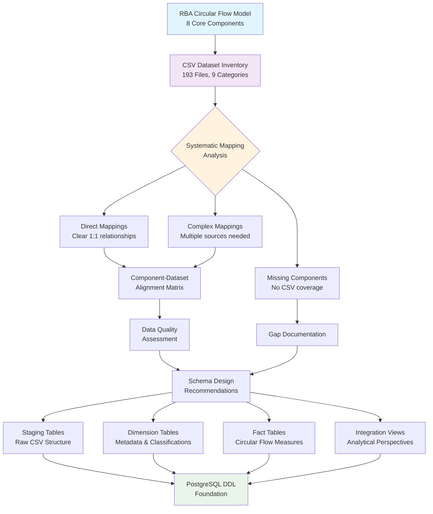

# RBA Circular Flow Model to CSV Dataset Cross-Reference Analysis Plan

**Project:** Systematic Cross-Reference Analysis for PostgreSQL Database Design  
**Date:** 2025-05-25  
**Scope:** Map RBA circular flow components to 193 CSV datasets  
**Approach:** High-level component mapping with hybrid database architecture

## Project Overview

This plan outlines a systematic approach to cross-reference the Reserve Bank of Australia's circular flow model components against available CSV datasets to create precise mappings for PostgreSQL database design. The analysis focuses on the 8 core circular flow variables and their representation within the 193 CSV files organized across 9 major categories (A-I series).

## Phase 1: Systematic Component Mapping

### Core Circular Flow Components

| Component | Economic Definition | RBA Model Role |
|-----------|-------------------|----------------|
| **Y (Income)** | Household disposable income, compensation of employees | Money flow from firms/government to households |
| **C (Consumption)** | Household final consumption expenditure | Money flow from households to firms |
| **S (Savings)** | Household net saving, financial flows | Leakage from household income to financial sector |
| **I (Investment)** | Gross fixed capital formation, business investment | Injection from financial sector to firms |
| **G (Government Expenditure)** | Government consumption and investment | Injection from government to firms/households |
| **T (Taxation)** | Government revenue streams | Leakage from households/firms to government |
| **X (Exports)** | Goods and services exports | Injection from overseas sector |
| **M (Imports)** | Goods and services imports | Leakage to overseas sector |

### CSV Dataset Categories Analysis

**Primary Mapping Sources:**
- **H Series (National Accounts)**: Direct source for C, I, G, Y components
- **I Series (International Trade)**: Direct mapping for X, M components
- **D Series (Credit/Monetary)**: Supporting data for S, I financial flows
- **B Series (Financial Institutions)**: Financial intermediation S→I flows
- **A Series (Central Banking)**: Government sector monetary operations
- **C Series (Payment Systems)**: Transaction flow validation for C
- **F Series (Interest Rates)**: Cost of capital affecting I, S decisions

**Secondary Supporting Sources:**
- **G Series (Inflation)**: Price deflators for real vs nominal analysis
- **J Series (Forecasts)**: Forward-looking indicators

### Mapping Methodology

1. **Direct Component Identification**: Match each of the 8 components to primary CSV datasets
2. **Supporting Variable Analysis**: Identify supplementary datasets that provide context or validation
3. **Coverage Assessment**: Document completeness of each component's representation
4. **Frequency Harmonization**: Analyze temporal alignment requirements

## Phase 2: Data-Component Alignment Analysis

### For Each Confirmed Mapping, Document:

#### 2.1 Dataset Specifications
- **Primary CSV File(s)**: Specific dataset name and RBA table identifier
- **Variable Mapping**: Column names corresponding to circular flow concepts
- **Alternative Sources**: Backup or supplementary datasets

#### 2.2 Data Characteristics
- **Frequency**: Daily/Weekly/Monthly/Quarterly
- **Temporal Coverage**: Historical span of available data
- **Units**: Currency ($ million), percentages, indices, counts
- **Seasonal Adjustment**: Original vs seasonally adjusted series
- **Price Basis**: Current prices vs chain volume measures

#### 2.3 Data Quality Assessment
- **Completeness**: Missing values, data breaks, series discontinuities
- **Consistency**: Alignment with economic definitions and RBA methodology
- **Reliability**: Data revision patterns and update frequency
- **Integration Potential**: Compatibility with related components

## Phase 3: Ambiguity and Gap Documentation

### 3.1 Coverage Gaps
- **Missing Components**: Circular flow elements lacking CSV representation
- **Partial Coverage**: Components with incomplete or fragmented data
- **Temporal Gaps**: Historical periods not covered by available datasets
- **Sectoral Gaps**: Missing institutional sector breakdowns

### 3.2 Mapping Ambiguities
- **Multiple Source Options**: Components represented in several CSV files
- **Definitional Conflicts**: Inconsistent variable definitions across datasets
- **Aggregation Mismatches**: Different levels of aggregation available
- **Overlapping Coverage**: Redundant data across multiple files

### 3.3 Integration Challenges
- **Frequency Harmonization**: Quarterly vs monthly vs daily alignment needs
- **Unit Standardization**: Currency, percentage, index reconciliation requirements
- **Seasonal Adjustment**: Consistent treatment across related series
- **Base Period Alignment**: Index and real value comparison periods

## Phase 4: Database Schema Recommendations

### 4.1 Hybrid Architecture Design

#### Staging Layer (Raw Data Preservation)
```sql
-- Example staging table structure
CREATE TABLE staging_rba_h1_gdp (
    extract_date DATE,
    series_id VARCHAR(50),
    period_date DATE,
    value DECIMAL(15,2),
    metadata JSONB
);
```

#### Dimension Tables (Reference Data)
- **Time Dimension**: Date hierarchies, frequency classifications
- **Economic Classification**: Circular flow components, sector mappings
- **Data Source**: CSV file metadata, RBA table references
- **Units & Adjustments**: Measurement types, seasonal adjustment flags

#### Fact Tables (Core Measurements)
```sql
-- Example circular flow fact table
CREATE TABLE fact_circular_flow (
    time_key INTEGER REFERENCES dim_time(time_key),
    component_key INTEGER REFERENCES dim_component(component_key),
    source_key INTEGER REFERENCES dim_source(source_key),
    value DECIMAL(15,2),
    unit_key INTEGER REFERENCES dim_unit(unit_key)
);
```

#### Integration Views (Analytical Perspectives)
- **Circular Flow Balance**: S+T+M = I+G+X validation views
- **Quarterly Aggregates**: Standardized frequency harmonization
- **Real vs Nominal**: Price-deflated analytical views
- **Growth Rates**: Period-over-period change calculations

### 4.2 Schema Design Principles

#### Primary Key Strategies
- **Time Series Tables**: Composite keys (date, series_id)
- **Cross-sectional Data**: Natural keys where available
- **Bridge Tables**: Surrogate keys for many-to-many relationships

#### Indexing Optimization
- **Temporal Queries**: B-tree indices on date columns
- **Component Analysis**: Composite indices on (component, time)
- **Source Traceability**: Indices on source/table references
- **Partitioning**: Monthly/quarterly partitions for large datasets

#### Data Validation Rules
- **Circular Flow Equilibrium**: CHECK constraints for S+T+M = I+G+X
- **Temporal Consistency**: Referential integrity across time periods
- **Unit Consistency**: Validation of measurement units within components
- **Range Validation**: Economic reasonableness checks

## Workflow Visualization



## Deliverable Structure

### Primary Analysis Document Sections

1. **Executive Summary**
   - Key findings overview
   - Critical gaps identified
   - Implementation complexity assessment

2. **Component Mapping Matrix**
   - Detailed cross-reference table
   - Primary and secondary source assignments
   - Coverage completeness ratings

3. **Data Source Analysis**
   - Per-component dataset specifications
   - Variable mapping details
   - Quality assessment results

4. **Ambiguity Register**
   - Documented mapping challenges
   - Resolution approaches and recommendations
   - Priority rankings for gap filling

5. **Schema Design Specifications**
   - Hybrid architecture detailed design
   - Table structures and relationships
   - Performance optimization strategies

6. **Implementation Roadmap**
   - Phase-based development sequence
   - Resource requirements and timelines
   - Risk mitigation strategies

## Quality Assurance Measures

### Validation Checkpoints

#### Economic Consistency
- **Circular Flow Identity**: Verify S+T+M = I+G+X balance capability
- **National Accounting**: Cross-check against standard GDP accounting identities
- **Temporal Logic**: Ensure flow vs stock variable distinctions

#### Technical Integrity
- **Data Completeness**: Systematic coverage verification across all 193 files
- **Frequency Alignment**: Temporal consistency across related components
- **Unit Harmonization**: Measurement standardization requirements

#### Implementation Viability
- **PostgreSQL Compatibility**: Schema design validation for target platform
- **Performance Requirements**: Indexing and partitioning adequacy assessment
- **Maintenance Complexity**: Long-term data management considerations

## Success Criteria

1. **Complete Component Mapping**: All 8 circular flow components mapped to CSV sources
2. **Gap Documentation**: Comprehensive identification of missing or ambiguous mappings
3. **Schema Foundation**: Production-ready PostgreSQL DDL specifications
4. **Implementation Readiness**: Clear roadmap for database development and data integration

## Risk Mitigation

### Identified Risks and Mitigation Strategies

| Risk | Impact | Mitigation Strategy |
|------|--------|-------------------|
| **Missing Component Data** | High | Document gaps, identify alternative sources |
| **Frequency Misalignment** | Medium | Design temporal harmonization procedures |
| **Definition Inconsistencies** | Medium | Create standardization mapping rules |
| **Performance Issues** | Low | Implement appropriate indexing and partitioning |

---

**Next Steps**: Proceed to implementation mode for detailed cross-reference analysis execution.