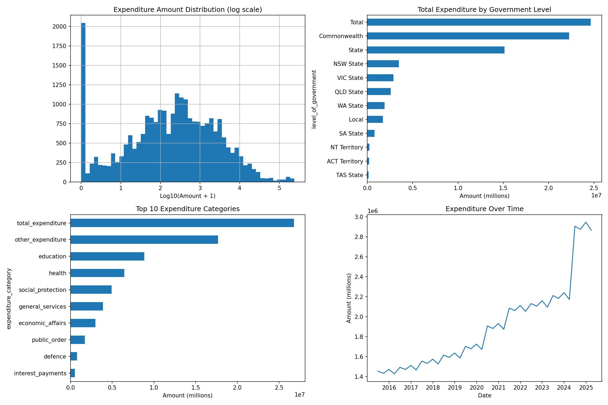

# Staging Data Validation Report
**Generated**: 2025-06-01 20:13:16
**Records Validated**: 27,624
**Issues Found**: 2
**Anomalies Detected**: 0

## Summary
- **CRITICAL**: 0 issues
- **WARNING**: 0 issues  
- **INFO**: 2 issues
- **NOTERROR**: 0 issues

## Statistical Summary

### Expenditure Data
- **Total Amount**: $75,941,094.30
- **Mean Amount**: $2,992.16
- **Median Amount**: $230.23
- **Std Deviation**: $14,570.65

## Issues by Severity

### INFO
- government_expenditure: 99 records for Local on 2024-09-30 - verify if expected
- government_expenditure: 99 records for Local on 2024-06-30 - verify if expected
